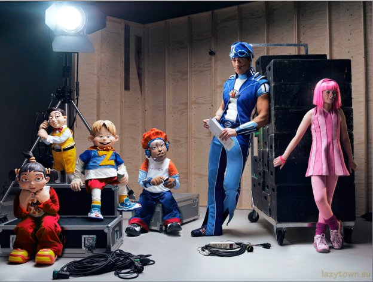

# My Fall

## Design Document

## General overview

Game genre - 3D puzzle with the elements of platformer, stealth and action

### Visual style

3D assets style - Low-poly minimalism

Visual setting – our world – TV show with decorations and backstage

Color palette is mostly bright

Props look artificial, but characters feel like alive

References:

   

### Player control

Character is human

Camera (mouse look) – 3rd person view (independent of character’s rotation)

WASD – walk / control mid-air

Space – jump

E – interact

LMB – Grab

*Additional:*

Space (mid-air) – climb / wall jump

LMB (mid-air near rope) – rope riding

### Core gameplay

During the level player has to solve simple puzzles to open and reach the door, set traps and avoid getting close to the enemies. There’re also levels with timer (REMOVED: changed my mind because timer doesn’t look appropriate)

*Win conditions*

Keep at least 1 HP

Set all the traps on the levels with traps, solve the puzzle on the levels with puzzle or both
Reach the door (it gets unlocked after all the traps are set or/and puzzle is solved)

Make it before the timer expires on the levels with timer (REMOVED)

*Lose conditions*

Lose all HP (by getting catched by enemies or stepping on a trap)

Miss the timer on the levels with the timer (REMOVED)

### Gameplay progress

Through the levels obstacles, enemies and puzzles become harder to overcome and solve

Gameplay systems and mechanics

### Systems

*Walk* – just an average person walk

*Jump* – should feel realistic, but still comfortable for platformer 

*Mouse look* – 3rd person camera that can move around character without affecting his rotation

### Mechanics

*Grab* – small objects can be grabbed and replaced to the floor or another object

*Floor button* – step or put a small object on the button to activate it. If all the buttons on the level are activated and rest win conditions completed, it will open the door leading to the next level

*Interaction* – on each level there’re preset locations with interactable props (traps, hiding spots)

*Ragdoll* – can be activated when player stepped on a trap

*Hiding spots* – trash containers, where Boris can hide to evade or stay safe from enemies (hat is exposed – joke on the stealth games genre). The hiding spots  are highlighted with the outline while chase

*“Coins”* – collectibles that are NOT necessary for level completion. Player gets better score and hears applause after collecting “coins”. They give a speed boost for 3 seconds.

*Traps* – being triggered by the player or the enemies, traps can “catch” them
All the traps have preset locations and they kind of change the geometry of the level. It makes player think carefully before setting traps. If someone gets catched by a trap, it can be set once again on the same spot.

*Extra abilities* – sometimes to collect “coins”, player has to perform “tricks” using *extra abilities*. They are also useful to overcome some obstacles and solve the puzzle or escape from the enemies.

*Traps types – their effect:*

Small glass balls – restrict movement for a while (character becomes ragdoll)

Launch pad – sends you in air (ragdoll)

Banana peel – slide forward anim restricting control, then fall as a ragdoll

Lifebouy – it falls down on the body around belt, restricts jump height and grabbing  for a while, activates walk animation without arms moves

Pie in the face – a pie is launched in character’s face, making it fall as ragdoll, restricts view with pie pieces (on the screen) and move speed for a while

*Extra abilities:*

*Wall jump*– protruding edge on the wall allowing player to bounce from it; to perform player has to collide the object and press jump button

*Climbing* – something like railing over the ledge which allows player to climb on the height

*Rope riding* – rope that allows player to overcome the distance

*Obstacles types – their role in level geometry:*

Small (<1m) – jump on top / grab and use as support

Pit – jump over / drop a small object to overcome

Medium (~1.5m) – go around / put a small object next to it and jump on top/ climb (extra ability) / wall jump (extra ability)

Big (>2m) – go around / make a tower of small objects to jump on / mix of small object, wall jump and climb

Wall – level boundaries

### AI:

Enemies have two main states: patrolling and chasing

Patrolling means moving between preset locations with a small break each time enemy reaches the location

While chasing, the enemy moves towards the player, but if the player is out of sight, he moves to the point where the player was last seen by this enemy

Stepping on a trap, enemy gets a negative effect

NOTES: 

- If player steps on a trap and enemy gets close enough to attack, enemy waits until player gets back to idle animation, then player won’t be able to escape from attack
- Each BP\_Enemy subclass instance placed in level needs to have at least 1 value added to PatrolLocations array to make the enemy get back to the patrol location after chasing
- If the enemy can’t reach player’s location,  he throws a pie towards player and then moves back to patrolling

### Parameters

Walk speed should feel like average person walking - 300 cm/s

Jump - quick push, quick fall, <1sec mid-air, ~1m height - 550 cm/s

Gravity should accompany the jump – 1.5

Enemy’s walk speed is lower than player’s – 130 cm/s

Enemy’s run speed is almost equal to player’s – 250 cm/s

## Level design plan

1. Basic movement training (backstage)
   1. Small static objects to jump over
   1. Trap (small glass balls) to set
   1. Unavoidable trap (small glass balls) to get catched
   1. Closed door that opens after setting the trap

location vibe reference

1. First puzzle (villain hideout)
   1. Small objects to grab and use for jumping on them
   1. Platforming part with pit
   1. Platforming part with medium size object
   1. Button
   1. Closed door that opens when the button is pressed
1. Two buttons (villain hideout)
   1. 3 small objects to grab and use for jumping on it/press buttons
   1. One of the small objects placed on the top of medium object
   1. 2 buttons
   1. Closed door (on the height of medium object) 

location vibe reference

1. Prepare for the first enemy (park)
   1. Inactive trap to activate
   1. Enemy goes for patrol and gets trapped
   1. Boris’s laugh and silence after
1. Groundhog Day (park)
   1. A lot of “coins”
   1. Some small objects to reach “coins”
   1. Button
   1. Closed door
1. Hurry up, there’s timer (maze) [REMOVED DUE TO BEING BORING]
   1. Timer
   1. The main puzzle is the maze itself
   1. Some activated traps
   1. Some hidden small objects
   1. Button
   1. Door
1. Extra abilities show up (playground)
   1. Wall jump to reach the top of medium object
   1. Ledge climbing to reach the top of medium object
1. Borzan (playground)
   1. Rope riding to jump between heights
1. Try to catch me! (playground)
   1. A few enemies
   1. 1-2 hiding spots
   1. A lot of parkour
   1. A little bit harder puzzle with small objects and button

location vibe reference

1. 3…2…1… launch! (Space ships station)
   1. Launch pad trap
   1. Enemy
   1. Hiding spot
   1. Hidden “coins”
   1. Some parkour
1. How you like that? (Space ships station)
   1. Big space ship
   1. Some parkour
   1. A few enemies
   1. Some glass balls and launch pad traps
   1. Medium puzzle
1. Everything looks so Unreal (Kid’s dream)
   1. Dark corridor as entry and finish
   1. Big heights with parkour
   1. A little bit lowered gravity to feel safe
   1. Medium puzzle
1. Nightmare (Kid’s dream)
   1. Darkness all around
   1. Some enemies
   1. Some active traps
   1. A little bit increased gravity to feel uncomfortable
   1. Medium difficulty puzzle
1. Low gravity (Moon)
   1. Dark atmosphere with the half of decorations and half of realistic space things (existing in Boris’s imagination)
   1. Some enemies
   1. Some traps
   1. Easy puzzle
1. Still Moon (Moon)
   1. Some enemies
   1. Some traps
   1. Medium difficulty puzzle

location reference

1. World so cold (Mountain)
   1. A lot of enemies
   1. A lot of traps
   1. Some parkour
1. Show’s great! (Mountain)
   1. A lot of “coins”
   1. A lot of traps
   1. A lot of enemies
1. Are we beating the charts? (Mountain)
   1. A lot of “coins”
   1. Most amount of traps
   1. Some enemies
   1. Everything starts looking like fake
1. Infinite laughter (Chocolate factory)
   1. 1-2 enemies
   1. Pie trap
   1. Most amount of “coins”
   1. All the location only exists in Boris’s imagination
1. Smile, we are legends now! (Chocolate factory)
   1. 1 enemy
   1. A lot of traps
   1. Some “coins”
1. Trapped in himself (Chocolate factory)
   1. No enemies, no puzzles, no “coins”
   1. A lot of traps
   1. Silence
1. What have you done? (“Chocolate” factory)
   1. Banana peel trap
   1. 1 hidden enemy that starts moving after trap is set
   1. Cutscene where enemy falls down into a mixer
   1. Boris’s laughter and complete silence 
   1. Camera flies out from Boris and shows every level (not exact copy, just a part from each)

## Storyline

### Lore

Main character is a show man named Boris. He was famous for toilet humor on local TV. And now he works as an actor in TV series for kids. His role is the bad guy making acts of sabotage and laughing on the good guys. His stage name is Mr. Bad. He’s not really enjoying the job, but his sense of humor makes him a star of this show. Boris is respected by the director and colleagues, so the atmosphere of communication is in his hands. Most parts of scenario become more powerful with his improvisations. Although their sponsor is always angry because of the bills issued by Boris. People are afraid of losing their job, so they make a tiny pressure on Boris in small talks. It’s becoming harder to generate jokes, because everything looks cheap and similar. Boris is tired of an unpromising career. He’s going to risk it and make the show great.

### Scenario

The first mention of each new mechanics is highlighted in Red

Sometimes during the game player will see phrases said from behind the camera by the director or actors or Boris’s own thoughts. Those phrases are highlighted in [Blue]

Act 1

[I can’t wait to surprise them all. My traps will make this show great!] – Boris

Backstage – “I can’t stay still”

Boris is preparing to show, warming up and testing the new small glass balls trap. He didn’t tell anyone about it for people to be naturally surprised seeing it on the stage. After setting a trap he gets trapped by another small glass balls trap that he forgot about. [Who left this mess here…] – Boris

Getting rid of it, he comes to the stage entry. [Here comes Boris. Action!] He comes in, applause.

Villain hideout – “Today they love me. But tomorrow…”

Boris is alone on the scene. His goal is to get outside and collect “coins” (optional). There’re multiple boxes and the locked door leading outside. To open it Boris has to push the floor button*.*

[Cut! Well done, my friend] – between levels

[You looked clumsy. Keep up with that!] – after 2 level

Outside – “It’s show time”

Boris comes out of a portable toilet in a park, following with the laughter of the audience. He goes towards a fence and sees a sign “beware of people”. There’s a trap to set. First enemy goes for a patrol and steps on the trap. Just in case there are some hiding spots. Boris laughs. Everything becomes silent. Trapped actor doesn’t know how to react. “Cut!”

[Cut!!! You were supposed to scare Alex, what is this trick?]

Act 2

[Just follow the scenario, alright?]

Park – “No tricks, Boris!”

“Action!”. Boris doesn’t look upset or nervous. His plan is only beginning. Now there’s a lot more “coins” to collect, so Boris has to do his usual job without any tricks. 

[Viewers love you, just do your job]

Maze – “I’m the Mr. Bad” (REMOVED)

Boris prefers to get out of the maze faster, so this level has a timer. After setting some traps Boris takes the height to spectate. He laughs again.

Playground – “I’m not that old”

The next scene is not about jokes. Traps can cause people falling down and breaking the limbs. There Boris decides to show his movement abilities: rope riding, wall jump and climbing. Next few levels will reveal Boris’s abilities and explain how to use them for solving puzzles.

[The next scene is ready. Please, don’t break anything expensive]

Act 3

Space ships launch station – “Euphoria”

Decorations are amazing. Boris was told not to break something expensive. But he’s not afraid of risking. He sees an opportunity to test a new trap – launch pad. Moving around with some extra abilities, Boris collects some “coins” placed in the difficult spots. And after setting a trap and solving a puzzle, he takes the height to spectate. It looks surprising, but very funny. Boris laughs. Audience is happy. Team feels tense.

[That’s wrong… You kind of harm the policeman] – actors team after 1 level

[Okay, guys, I have to say it. We got way too good ratings from the last show. It’s a thin ice, but maybe Boris’s improvisations don’t harm the show] – after 1 level

[You all did a great job today. Hopefully, this material will bring us best ratings] – after 2 level

[Of course it will. And that’s all because of me!] – Boris after 2 level

Kid’s dream (Alice in the wonderland for the reference) – “So far so good”

Everything looks like the reality ends here. Even though Boris has a plan, this place looks too pure to set any traps. He decides to perform more tricks. So there’s a lot of “coins”, the goal is to solve the puzzle and open the door.

Kid’s nightmare – “Don’t look back”

Fear never felt more real. Watch out for traps, there’s new one – lifebuoy trap.

Act 4

Moon – “My knees don’t hurt”

Most props look like decoration, but somewhy there’s Moon like gravity. Boris feels brave enough to test his new trap: banana peel. It doesn’t feel like it’s bothering people. He sets a lot of traps on the next few levels. He only hears applause. In his head it’s the success.

[Cut! Look, it seems to go the wrong way. Our sponsor says he got troubles with the channel because of your tricks.] – between levels

[But the show is great! I can’t stop halfway] – Boris between levels

[We became most viewed last week, but our show is risking to get closed due to bad morality and too expensive decorations] – between levels

[No way you did this again. Boris, there was a scenario. Can you at least pretend to try doing things right?] – after 2 level

[A bunch of snobs are trying to teach me morality!] – Boris after 2 level

Mountains – “It’s getting cold”

Actors are freezing. Next few levels will contain most amount of enemies, but allow to use all the extra abilities while collecting “coins” and setting traps. Boris feels like it’s the best chance to make the show great. So he tries his best.

[What’s wrong with you? We are all risking to lose our job] – actors team after 1 level

[They are right, my friend. We already paid some fines and it’s not going to end well unless you get back to your old methods] – after 1 level

[I’m the one making the show! Boring dummies only care about the money] – Boris after 1 level

[It’s over, I’m breaking your contracts] – sponsor after 2 level

[No, please, sir, listen…] – after 2 level

[I will shine, it’s my show!] – Boris after 2 level

Act 5 (last)

Chocolate factory – “Boris’s legacy”

Boris tries new trap – pie in the face. Audience reaction makes Boris think he’s doing great. There’s not a lot of enemies nearby. No more puzzles. He just sets all the traps without a big risk. He doesn’t perform a lot of tricks. It becomes empty and more silent.

Last level – “What have you done?”

Boris sets a banana peal trap near “chocolate mixer”. Actor falls down. Decorations smoothly disappear. Boris finds himself in a real factory. He smiles insanely and whispers: “Cut…”

## Appearance

### Animations

1. Player
   1. Idle
   1. Walk (forward)
   1. Jump (pushing from ground, flying phase, landing)
   1. Grab (different variation for each grabbable object)
   1. Set the trap
   1. Hide and go out
   1. Sliding on banana peel
   1. Walk with tied hands by the lifebouy
   1. Climbing
   1. Rope riding
   1. Stand up from ragdoll
1. Enemy
   1. Idle
   1. Patroling (walking)
   1. Chasing
   1. Stand up from ragdoll
   1. Sliding on banana peel
   1. Catch player
   1. Jump
   1. Walk with tied hands by the lifebuoy
   1. Recovery after running

### Sound design

Music should feel like heart beat, getting faster while chase, getting slower while hiding

Body moves and interactions with environment are accompanied with cartoon-lke sounds, applause and laughter of “audience”

### VFX

Minimalistic small particles

- Pie trap and pie throw makes bigger cartoon-like pie pieces particles

### User interface

Only nescesarry things (e.g. timer, “coins” counter appearing for a few sec)

Minimalistic menu

HP is Boris’s face emotion (sad = low hp, happy = full hp)

Additional information about workflow

## Programming and game design notes

\- Make sure “generate overlap events” is checked for all the obstalces (to call “stop grabbing” on overlapping “GrabbedObjectBottomCollision” by any obstacle)

\- Each BP\_Enemy subclass instance placed in level needs to have at least 1 value added to PatrolLocations array to make the enemy get back to the start location after chasing; the spawn location should be the last in array

\- Each BP\_Dumpster placed in world needs to have additional NavModifierVolume inside of mesh to prevent enemy stucking inside of dumpster. Area class inside of it should be set to obstacle

\- Each BP\_Door contains an instance editable variable “TrapsRequiredToWin”. For levels with traps this variable should be manually set in the instance of BP\_Door

\- Don’t EVER forget, that when you attach a mesh (especially if it’s invisible) to a character, it’s collision causes obnoxious lagging. I was already disappointed about trying to fix it. But freaking invisible pie mesh on BP\_Enemy was breaking the game all the time!

- BP\_Rope works different from different sides (e.g. if you can properly swing on X coordinate, Y coordinate swinging would be kind of stucking). So it should be rotated towards the intended jump point

### Timeline

No deadlines, just learn and produce

